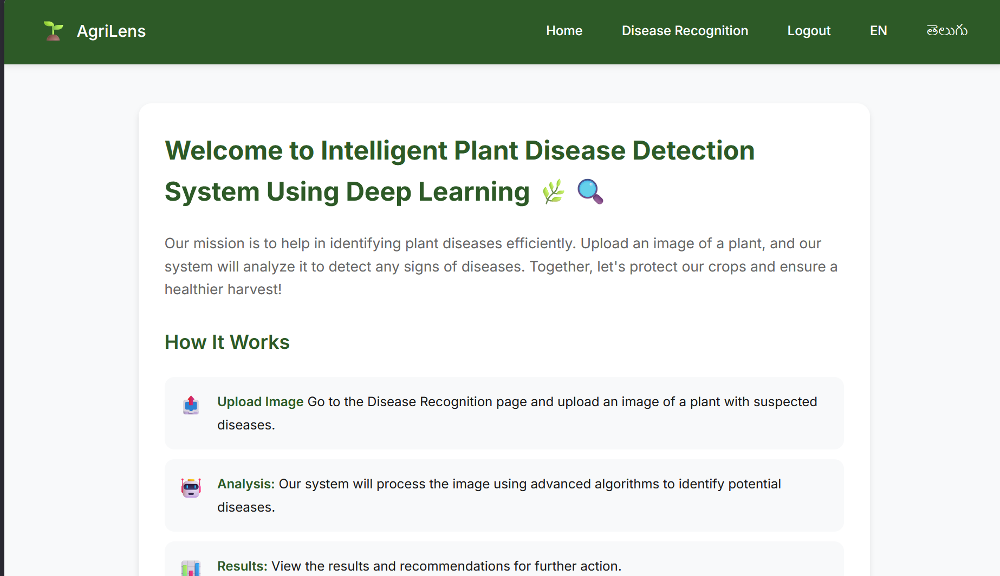
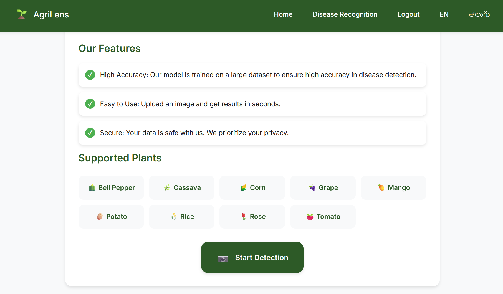
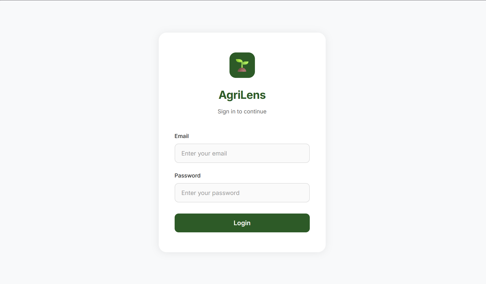
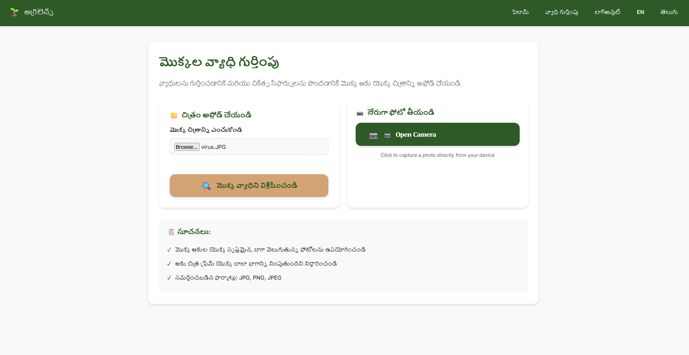
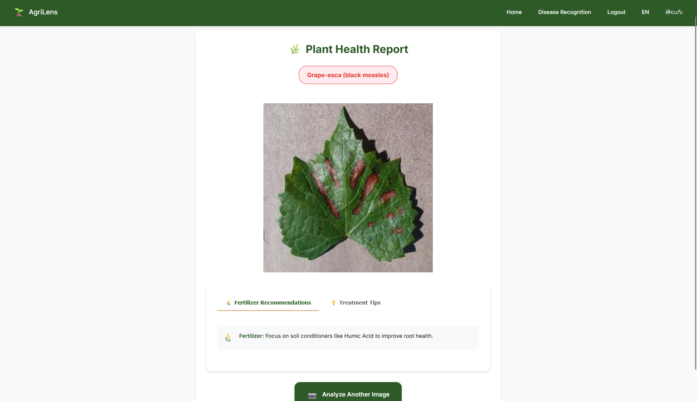

# 🌿 AgriLens: AI-Based Plant Disease Detection System

AgriLens is an AI-powered web application that detects plant diseases from leaf images using Deep Learning. The system leverages a Convolutional Neural Network (CNN) trained on over **5,000+ plant leaf images** to identify diseases with **92%+ accuracy** and provides fertilizer recommendations and treatment tips. A multilingual interface improves accessibility for farmers and users from different linguistic backgrounds.

---

## 📌 Features

- 🌱 AI-powered plant disease detection
- 🧠 CNN model built using TensorFlow/Keras
- 📸 Upload plant leaf images for real-time prediction
- ⚡ Flask-based web application
- 🌍 Multilingual support (English & Telugu)
- 💊 Disease-specific fertilizer recommendations
- ✅ Treatment and prevention tips
- 📱 Simple and user-friendly interface

---

## 🛠️ Tech Stack

- **Programming Language:** Python
- **Machine Learning:** TensorFlow, Keras (CNN)
- **Backend Framework:** Flask
- **Frontend:** HTML5, CSS3, JavaScript
- **Image Processing:** Pillow (PIL)
- **Scientific Computing:** NumPy
- **Development Tools:** Git, VS Code

## 📂 Project Structure

```
AgriLens/
│── static/
│   ├── uploads/
│   ├── css/
│   ├── js/
│   └── images/
│
│── templates/
│   ├── login.html
│   ├── home.html
│   ├── disease-recognition.html
│   └── prediction.html
│
│── Team3model.h5
│── app.py
│── requirements.txt
│── README.md
```

---

## 🚀 How It Works

1. Open the AgriLens web application.
2. Upload a clear image of a plant leaf.
3. The image is preprocessed and resized.
4. The trained CNN predicts the disease.
5. The application displays:
   - Predicted Disease
   - Fertilizer Recommendation
   - Treatment Tips
6. Users can switch between supported languages.

---

## 📊 Model Details

- **Model Type:** Convolutional Neural Network (CNN)
- **Framework:** TensorFlow/Keras
- **Training Dataset:** 5,000+ Plant Leaf Images
- **Input Image Size:** 256 × 256 pixels
- **Accuracy:** 92%+

---

## 🌿 Supported Crops

The system can identify diseases across multiple crops, including:

- Tomato
- Potato
- Rice
- Corn
- Mango
- Grape
- Bell Pepper
- Cassava
- Rose

with **38 disease and healthy classes**.

---

## 🌍 Multilingual Support

AgriLens currently supports:

- 🇺🇸 English
- 🇮🇳 Telugu

The multilingual interface enables farmers to access disease information in their preferred language.

---

## 💡 Key Highlights

- Real-time disease prediction
- Deep Learning-based image classification
- Automatic fertilizer recommendations
- Crop-specific treatment suggestions
- Easy-to-use web interface
- Responsive design
- Multilingual accessibility

---

## ⚙️ Installation

### Clone the Repository

```bash
git clone https://github.com/
cd AgriLens
```

### Create Virtual Environment (Optional)

```bash
python -m venv venv
```

**Activate:**

```bash
venv\Scripts\activate
```


### Install Dependencies

```bash
pip install -r requirements.txt
```

### Run the Application

```bash
python app.py
```

Open your browser and visit:

```
http://127.0.0.1:5000
```

---
# Output








## 📈 Future Enhancements

- Mobile Application
- Additional Regional Languages
- Cloud Deployment
- Live Camera Detection
- Weather-based Disease Prediction
- IoT Sensor Integration

---

## 👨‍💻 Author
G.Poorna
---
